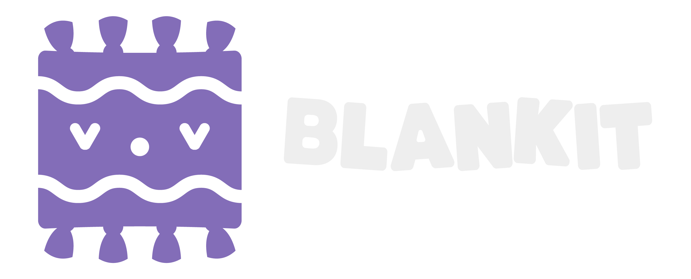

> ⚠️ WARNING ⚠️
>
> Blankit is still in active development, and has not been tested in a production environment!

Wrap your Godot game project in a cozy Blankit!

[Documentation](https://blankit.tools) • [Godot Asset Library](https://godotengine.org/asset-library/asset/3907)

An all-in-one framework for making games in the Godot Engine, Blankit contains a ton of tools to allow you to jump straight into actually building your game, without worrying about common systems.

## ⚖️ License

Blankit is licensed under The MIT License, and is completely free of charge. Do whatever you want with it!

## 🙋‍♀️ Support

If you encounter any issues or have questions, feel free to [submit an issue](https://github.com/yukonmakesgames/blankit/issues)!

Made with 💖 by [Yukon](https://yukonmakes.games).
